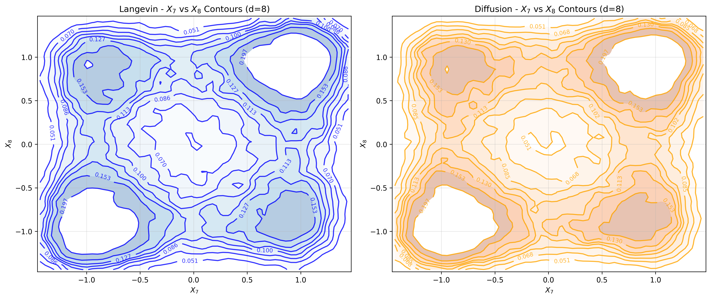
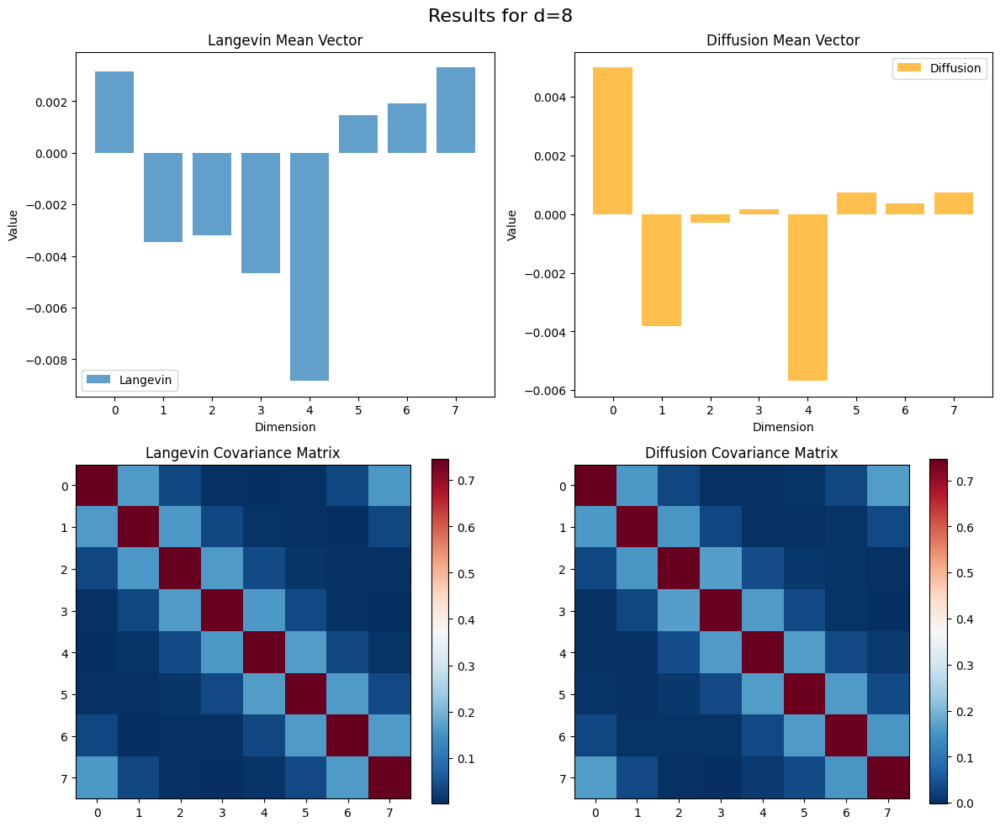
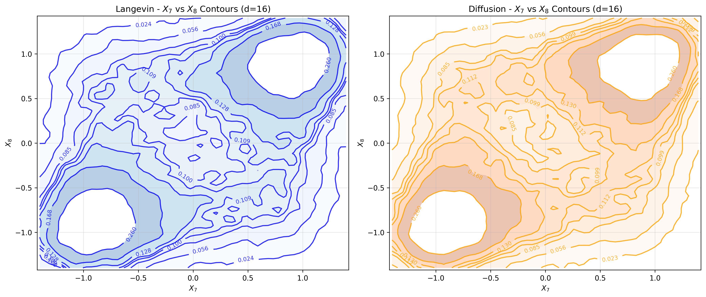
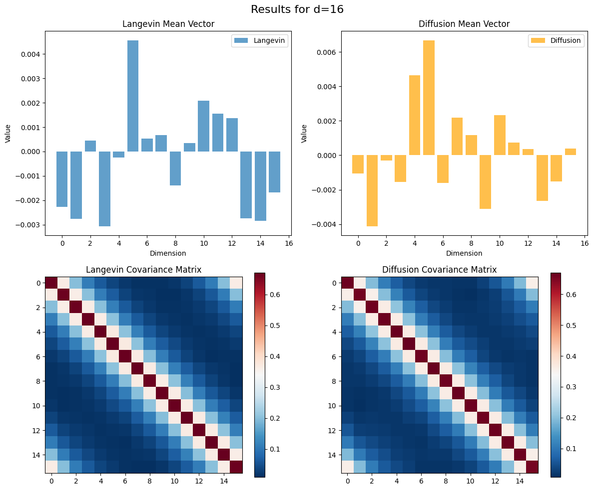
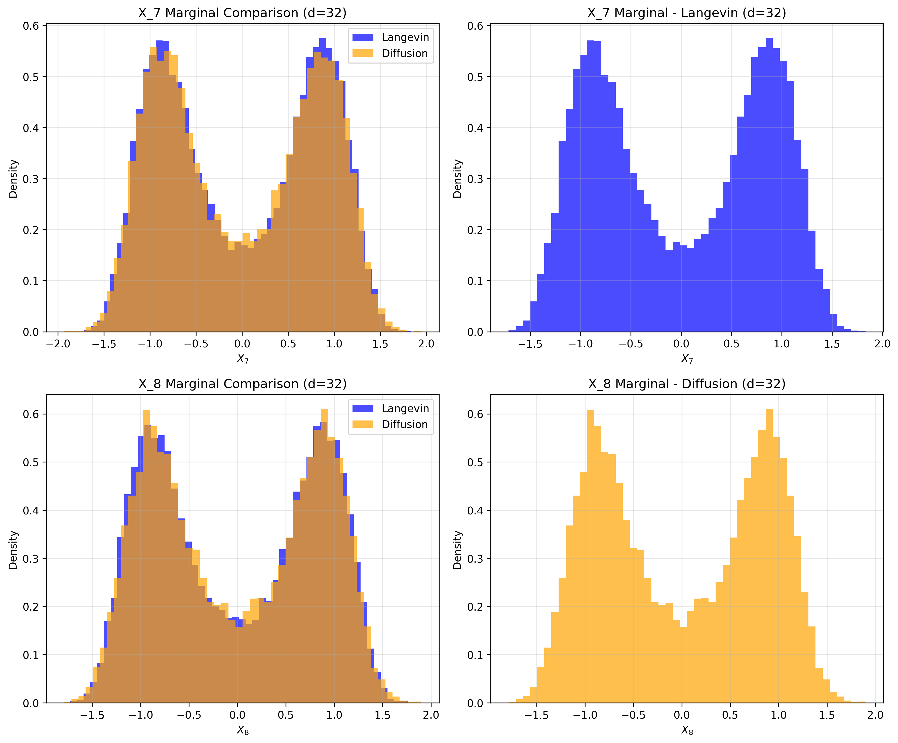
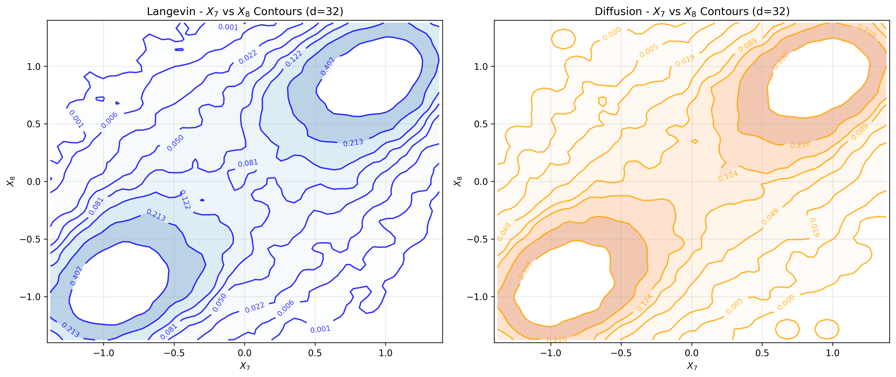
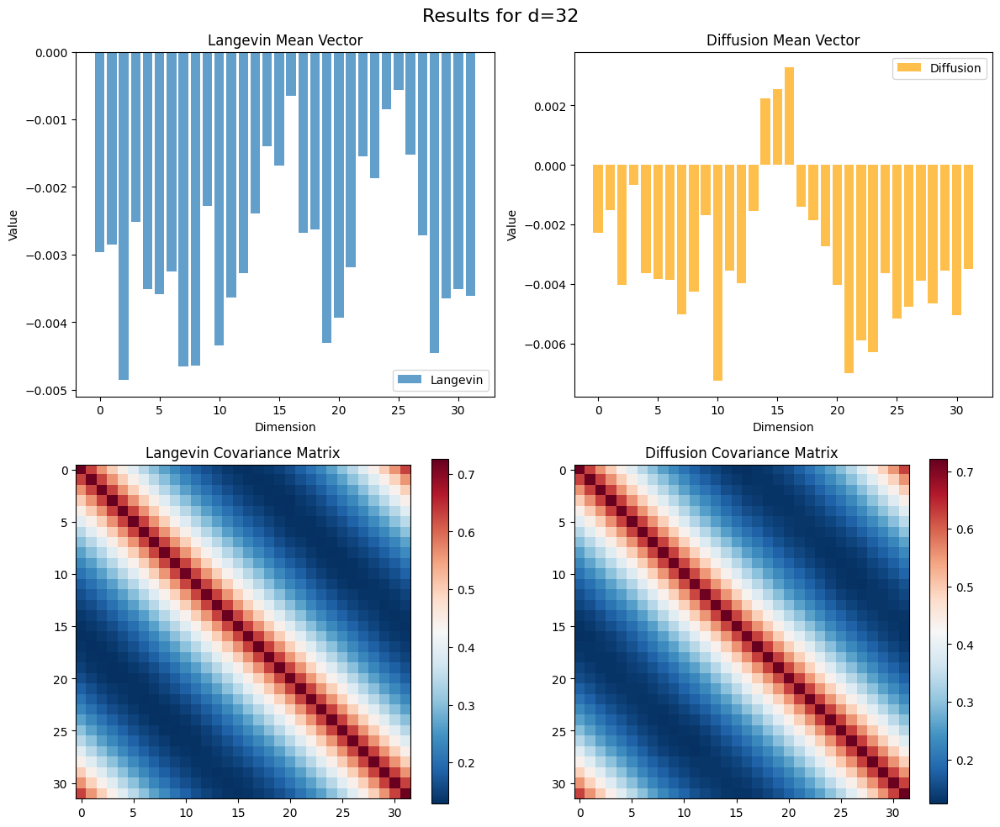
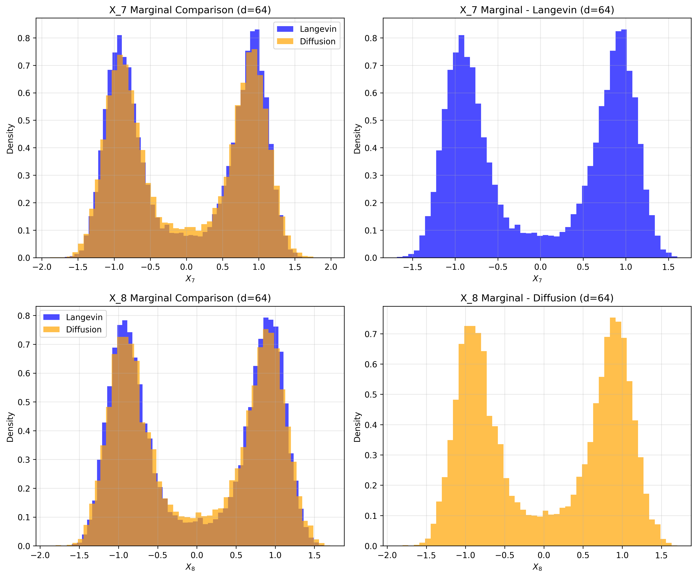
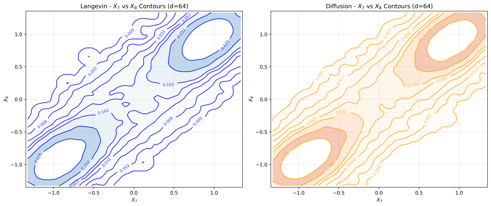
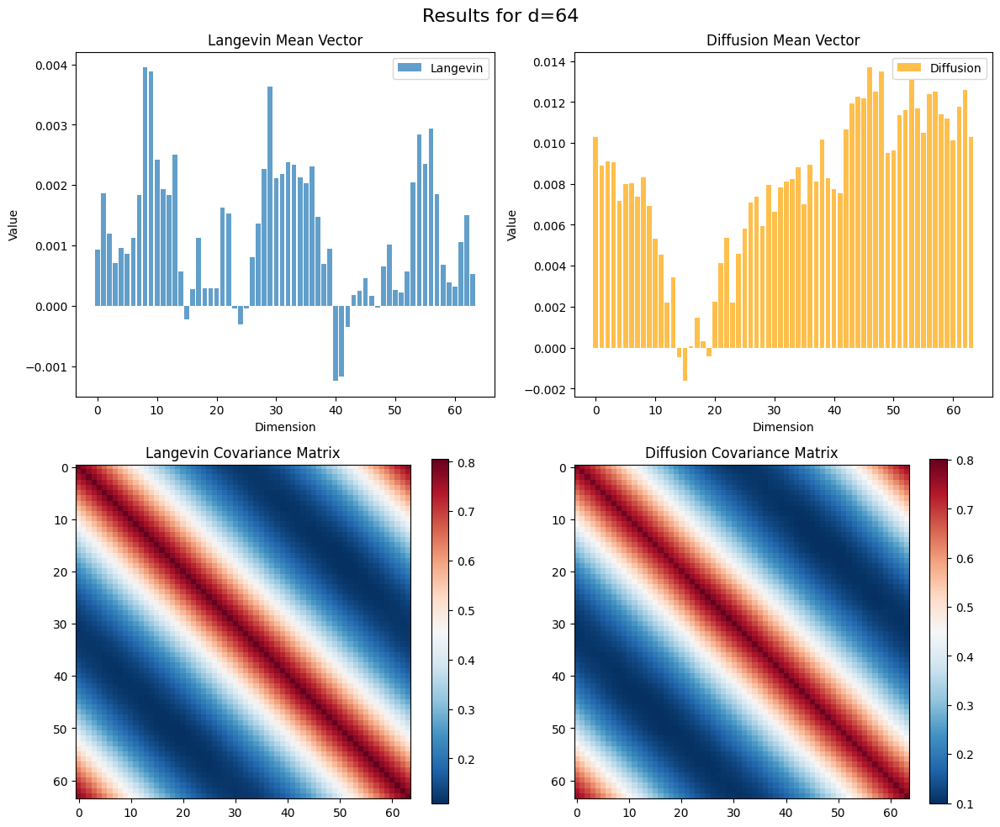

# Training Score Based Diffusion Model

Warren Liu

### Gen AI disclosure

I had issues trying to get the code to work, so I let Gemini and Claude go hail mary on my old work and refactor the code. I also double checked my old langevin code to ensure that it works.

## Problem Summary

We are given the following Langevin Dynamics

$$ dX_t = -\nabla V(X_t) dt + \sqrt{2 T} dW_t$$

With Potential

$$ V(x_1,\dots, x_d)
= \frac{\lambda}{2} \sum_{i=1}^{d+1}
  \left(\frac{x_i - x_{i -1}}{h}\right)^2
  + \frac{1}{4\lambda}(1 - x_i^2)^2 $$

Below is a summary of the dynamics we wish to simulate!

$$
\begin{array}{|l|l|}
\hline
\textbf{Parameter} & \textbf{Expression / Value} \\
\hline
\text{Potential: } V(X) \\ V(x_1,\dots, x_d)  &
\displaystyle
\frac{\lambda}{2} \sum_{i=1}^{d+1}
  \left(\frac{x_i - x_{i -1}}{h}\right)^2
  + \frac{1}{4\lambda}(1 - x_i^2)^2 \\
\hline
x_0, x_{d+1} & 0 \\
\hline
d & 20 \\
\hline
h & \displaystyle \frac{1}{d+1} \\
\hline
\lambda & 0.03 \\
\hline
\text{Domain} & [-L,L]^d,\quad L=2.5 \\
\hline
\text{Temperature} & T=8 \\
\hline
\text{Gibbs Measure} & \frac{\exp(-\frac{V(x)}{T})}{Z} \\
\hline
\text{d-Langevin Dynamics} & N=10^6\ \text{samples, starting from } \mathcal{N}(0,I_d) \\
\hline
\end{array}
$$

### Simulating $N_c \geq 10^6 $ samples of Langevin Dynamics using Euler Maruyama

To carry out the above simulation, we must compute the gradient and then also express this problem as an Euler Maruyama discretization

The Gradient $ \nabla V(X) $ is defined as

$$
\begin{align*} 
\frac{\partial V}{\partial x_i} &=\frac{\lambda}{h^2} (2x_j - x_{j-1} - x_{j+1}) - \frac{1}{\lambda} x_j(1-x_j^2)
\end{align*}
$$

And we take the Euler Maruyama discretization for the above langevin dynamics to be, for $\xi_n \sim N(0, I_D)$

$$X_{n+1} = X_n -\nabla V(X_n) \Delta t + \sqrt{2T \Delta t} \xi_n$$

## Simulating Langevin Dynamics

Aside: to show sample based error decaym we can simulate for a given dimension, using N ranging from $2^{10}, 2^{12}, \dots, 2^{20}$. For our purposes we run langevin for $d = 16, 32, 64, 128$ with fixed $N = 200000$

Note, for $d=128$, the coupling parameter is too extreme, and the memory constraints prevented me from training the model. I have thus reduced the dimensionality to d=64.

## Training the Score Based Diffusion Model

Instead of using a specific Variance-Preserving SDE like Ornstein-Uhlenbeck, I used the general VP SDE in Yang Song's paper.

First, the loss function objective is defined below as:

$$\mathbb{E}_{p(\mathbf{x})} [\|\nabla_{\mathbf{x}} \log p(\mathbf{x}) - s_{\theta}(\mathbf{x})\|_{2}^{2}] = \int p(\mathbf{x}) \|\nabla_{\mathbf{x}} \log p(\mathbf{x}) - s_{\theta}(\mathbf{x})\|_{2}^{2} d\mathbf{x}$$

#### Forward SDE

The forward process perturbs, or adds noise to the data. It is represented by the following SDE.

$$dX_t = - \frac{1}{2} \beta(t) X_t dt + \sqrt{\beta(t)} dW_t$$

#### Reverse SDE

The reverse process, given a score, turns gaussian noise into new generated samples. It is represented by the following SDE

$$dX_t = \left[ - \frac{1}{2} \beta(t) X_t - \beta(t) \nabla_{X_t} \log p_t(X_t) \right] dt + \sqrt{\beta(t)} d\bar{W}_t$$

## Training Results

In general, while the mean vectors can be off, the covariance structure is very well preserved! This indicates strong training results for the score function. However, using a convolutional Neural Network comes with the cost of training complexity and time. For 100k samples, the models commonly took nearly 2 hour to train and sample from!

### d = 8

Figure 1.1: Marginal density comparisons for the $d=8$ case. The plots demonstrate that our score-based diffusion model effectively captures the bimodal structure of the target distribution in both $X_7$ and $X_8$ dimensions, closely matching the ground truth Langevin dynamics.

Figure 1.2: Contour Plot for the $X_7$, $X_8$ Marginals.

Figure 1.3: Plotting Mean and Covariance for $d=8$. Note the less accurate mean fit, but the covariance structure is well preserved!

### d = 16

Figure 2.1: Marginals for $d=16$

Figure 2.2: Contour Plot for the $X_7$, $X_8$ Marginals, $d=16$.

Figure 2.3: Mean and Covariance for $d=16$

### d = 32

Figure 3.1: Marginals for $d=32$

Figure 3.2: Contour Plot for the $X_7$, $X_8$ Marginals, $d=32$.

Figure 3.3: Mean and Covariance for $d=32$

### d = 64

Figure 3.1: Marginals for $d=64$

Figure 3.2: Contour Plot for the $X_7$, $X_8$ Marginals, $d=64$.

Figure 3.3: Mean and Covariance for $d=64$

### Comparison of Mean/Cov Differences

| Dimension | Mean L1 | Mean L2 | Cov Frobenius | Final Loss | Samples |
| :--- | :--- | :--- | :--- | :--- | :--- |
| 8 | 0.017937 | 0.007393 | 0.023180 | 0.232214 | 100000 |
| 16 | 0.027052 | 0.008234 | 0.055572 | 0.205686 | 100000 |
| 32 | 0.053332 | 0.012803 | 0.143263 | 0.147310 | 100000 |
| 64 | 0.435585 | 0.061964 | 0.878410 | 0.097525 | 100000 |

## Summary

In general, we observe good fit with a CNN based architecture. While the peaks get ever further from each other as the dimensions increase, we observe increasing error. For d=128, the structure was incredibly tough to simulate due to overflows and coupling changes. This led to me not simulating it.

### Resources Used:

[1] https://yang-song.net/blog/2021/score/

[2] Song et al, 2021. SCORE-BASED GENERATIVE MODELING THROUGH STOCHASTIC DIFFERENTIAL EQUATIONS (ICLR 2021). https://openreview.net/pdf?id=PxTIG12RRHS